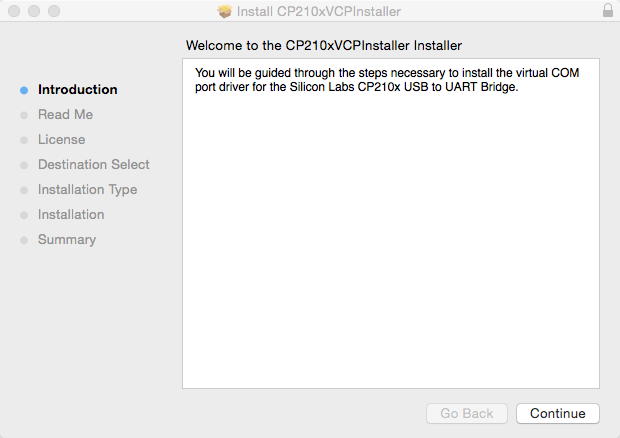
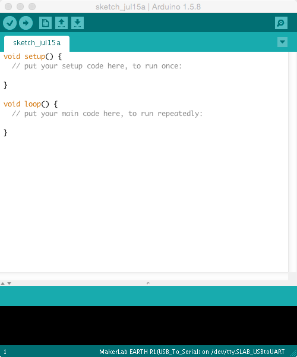
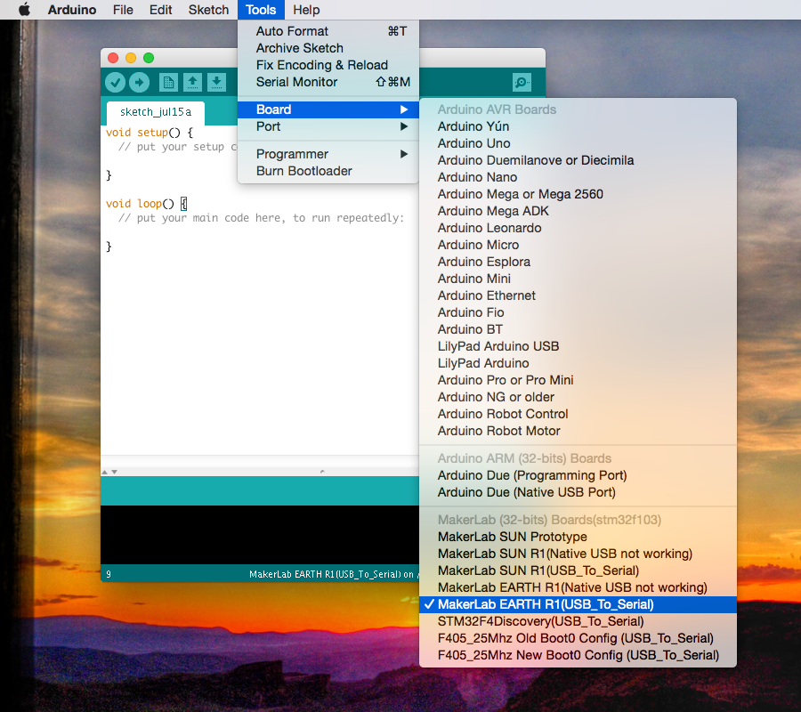
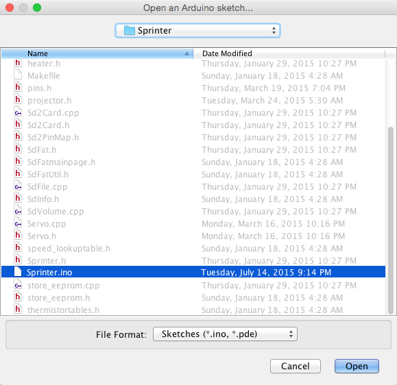
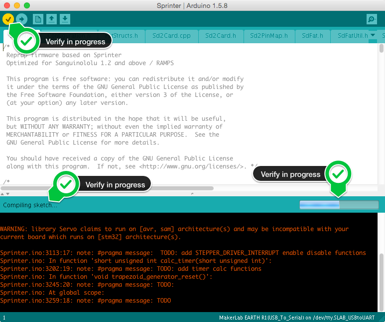
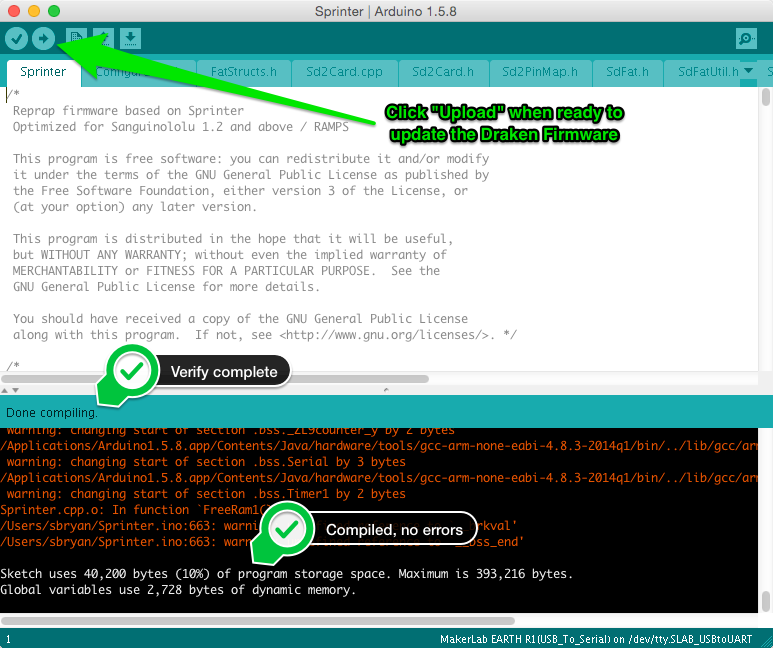

# Firmware

The Draken firmware is a combination of code for Sprinter, grbl and marlin, according to the comments in `Sprinter.ino`:

```
/*
  This firmware is a mashup between Sprinter, grbl and parts from marlin.
  (https://github.com/kliment/Sprinter)

  Changes by Doppler Michael (midopple)

  Planner is from Simen Svale Skogsrud
  https://github.com/simen/grbl

  Parts of Marlin Firmware from ErikZalm
  https://github.com/ErikZalm/Marlin-non-gen6
*/
```

Read more about GCodes:

* [Descriptions of GCodes](http://linuxcnc.org/handbook/gcode/g-code.html)
* [Reprap GCodes](http://objects.reprap.org/wiki/Mendel_User_Manual:_RepRapGCodes)

## How to update the firmware on the Draken

### Windows
*_Copy from Forum post_*
### OS X
1. Get the various files you will need
   * Silicon Labs USB-UART driver for OS X:
     http://www.silabs.com/Support%20Documents/Software/Mac_OSX_VCP_Driver.zip
   * STM32F103XX board support files for Arduino 1.5.8:
     https://github.com/MakerLabMe/MakerLabBoard/archive/master.zip
   * Draken Arduino 1.5.8 IDE for OS X:
     https://drive.google.com/file/d/0ByK3W2c482S4RWF2T3ktUF9hRzQ/view?usp=sharing
   * Firmware sources for the Draken from one of the following places:
      - git clone https://github.com/sbryan/Draken
      - https://drive.google.com/file/d/0ByK3W2c482S4cnh4aUJ1Z2ViR1k/view?usp=sharing

   **NOTE**: For the rest of these instructions, we will assume all files have been saved in your `~/Downloads/` directory


2. Install the Silicon Labs USB-UART driver

  ```bash
  $ cd ~/Downloads/
  $ unzip Mac_OSX_VCP_Driver.zip
  #Archive:  Mac_OSX_VCP_Driver.zip
  #  inflating: SiLabsUSBDriverDisk.dmg
  $ hdiutil attach ./SiLabsUSBDriverDisk.dmg
  #/dev/disk2                /Volumes/Silicon Labs VCP Driver Install Disk
  $ open /Volumes/Silicon\ Labs\ VCP\ Driver\ Install\ Disk/Silicon\ Labs\ VCP\ Driver.pkg
  # The following screenshot shows the SiLabs USB to UART driver installer
  ```

  ||
  |:--------------------------:
  |Click the <button>**Continue**</button> and complete the driver installation|

3. Install the Draken Arduino 1.5.8 IDE

  ```bash
  $ cd ~/Downloads/
  $ unzip STM32_Arduino_Cores-master.zip
  #Archive:  STM32_Arduino_Cores-master.zip
  #a94989f76d59ecd5b925369564ef20bece151243
  #   creating: STM32_Arduino_Cores-master/
  # extracting: STM32_Arduino_Cores-master/.gitignore
  #  inflating: STM32_Arduino_Cores-master/boards.txt
  # ...
  #  inflating: STM32_Arduino_Cores-master/variants/template/variant.h
  $ unzip Arduino1.5.8.Mac.zip
  #Archive:  Arduino1.5.8.Mac.zip
  #   creating: Arduino1.5.8.app/
  #   creating: Arduino1.5.8.app/Contents/
  #   creating: Arduino1.5.8.app/Contents/_CodeSignature/
  #  inflating: Arduino1.5.8.app/Contents/_CodeSignature/CodeResurces
  # ...
  #finishing deferred symbolic links:
  #  Arduino1.5.8.app/Contents/Java/hardware/arduino/stm32 -> /Volumes/SHARED/projects/STduino/stm32/
  #
  # Need to fix that bogus symbolic link above: Arduino1.5.8.app/Contents/Java/hardware/arduino/stm32
  $ rm Arduino1.5.8.app/Contents/Java/hardware/arduino/stm32
  $ ln -s STM32_Arduino_Cores-master Arduino1.5.8.app/Contents/Java/hardware/arduino/stm32
  # Now move it up to /Applications
  $ sudo mv Arduino1.5.8.app /Applications/.
  #
  # Fix the execution restrictions enforced by OS X Gatekeeper
  $ sudo spctl --master-disable
  $ sudo spctl -a /Applications/Arduino1.5.8.app
  # If an application passes and has a rule available then you’ll get no response.
  # If there’s no rule for the application, you’ll get a response like:
  #   /Applications/Arduino1.5.8.app: unknown error 99999=1869f
  #
  # Assign a label and enable it to be executed
  $ sudo spctl --add --label "Arduino1.5.8" /Applications/Arduino1.5.8.app
  $ sudo spctl --enable --label "Arduino1.5.8"
  #
  # Be sure to re-enable Gatekeeper
  $ sudo spctl --master-disable
  ```

3. Unzip the Draken Firmware sources

  ```bash
  $ cd ~/Downloads/
  $ unzip DrakenFirmware.zip
  ```

4. Start the Draken Arduino 1.5.8 IDE

  - Launch Finder and browse to /Applictions
  - Find and launch **Arduino1.5.8.app**

  OR

  - From the command line:
    ```bash
    $ open -a Arduino1.5.8.app
    ```

  |Initial window of the Arduino 1.5.8 IDE|
  |:--------------------------:
  ||

5. Check Board and Port settings

  |Select Tools -> Board -> MakerLab EARTH R1 (USB_To_Serial)|
  |:--------------------------:
  ||

  |Select Tools -> Port -> /dev/tty.SLAB_USBtoUART|
  |:--------------------------:
  ||

6. Open the Draken firmware sketch

  |Select File -> Open and browse to ~/Downloads/DrakenFirmware/Sprinter.ino|
  |:--------------------------:
  ||

7. Verify the firmware

  |Select Sketch -> Verify|
  |:--------------------------:
  ||

8. Upload the firmware

  |Select File -> Upload|
  |:--------------------------:
  ||

9. Boot up the Draken and confirm it works

  *_TODO_*

### Linux
*_TODO_*


